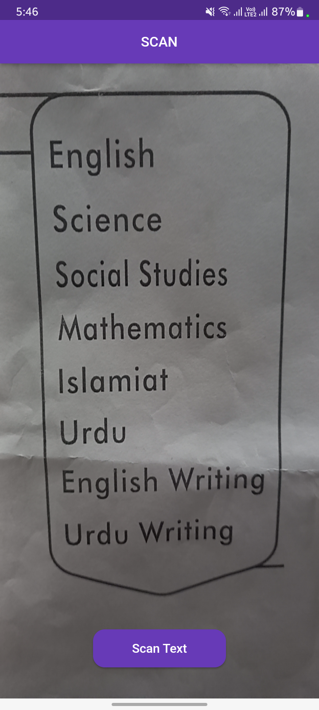
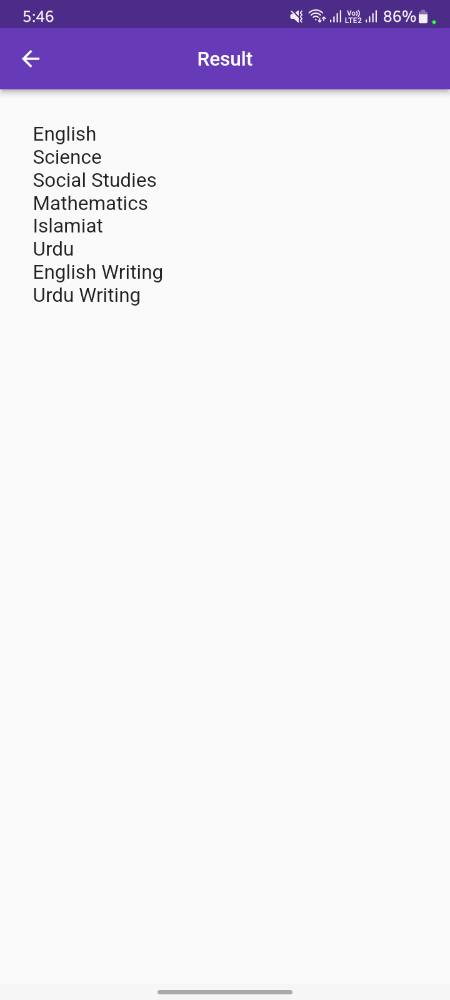

# Image to Text - Flutter App


## Overview

The "Image to Text" Flutter app allows users to extract text from images using the device camera. It utilizes the Google ML Kit Text Recognition API to perform Optical Character Recognition (OCR) on the images captured through the camera.

## Features

- Capture images using the device camera
- Extract text from the captured images using OCR
- Display the extracted text in real-time
- Simple and user-friendly interface

## Dependencies

This app relies on the following Flutter packages:

- [google_mlkit_text_recognition](https://pub.dev/packages/google_mlkit_text_recognition): A Flutter plugin to use the ML Kit Text Recognition API from Google for extracting text from images.
- [permission_handler](https://pub.dev/packages/permission_handler): A Flutter plugin for requesting runtime permissions on both Android and iOS platforms.
- [camera](https://pub.dev/packages/camera): A Flutter plugin to access the device camera and take pictures.

Copywrites: - [Malik Hammad](https://github.com/mrhammaddev)

## Getting Started

To run this app locally on your machine, follow these steps:

1. Clone this repository:
   ```bash
   git clone https://github.com/Mrhammaddev/Image_to_Text_Flutter.git
2. Change into the app directory:
   ```bash
   cd image_to_text_flutter_app
3. Get the required dependencies by running:
   ```bash
   flutter pub get
4. Connect a physical device or start an emulator.

5. Run the app:
   ```bash
   flutter run

## Screenshots
<!-- Add some beautiful app screenshots here to showcase the app's functionality -->
<p align="center">
  
  
</p>

## Permissions
The app requires the following permissions:

Camera: To capture images and perform OCR on them.
Storage: To save the captured images temporarily during the OCR process.


## Known Issues
List any known issues or limitations of the app, if any.

  
